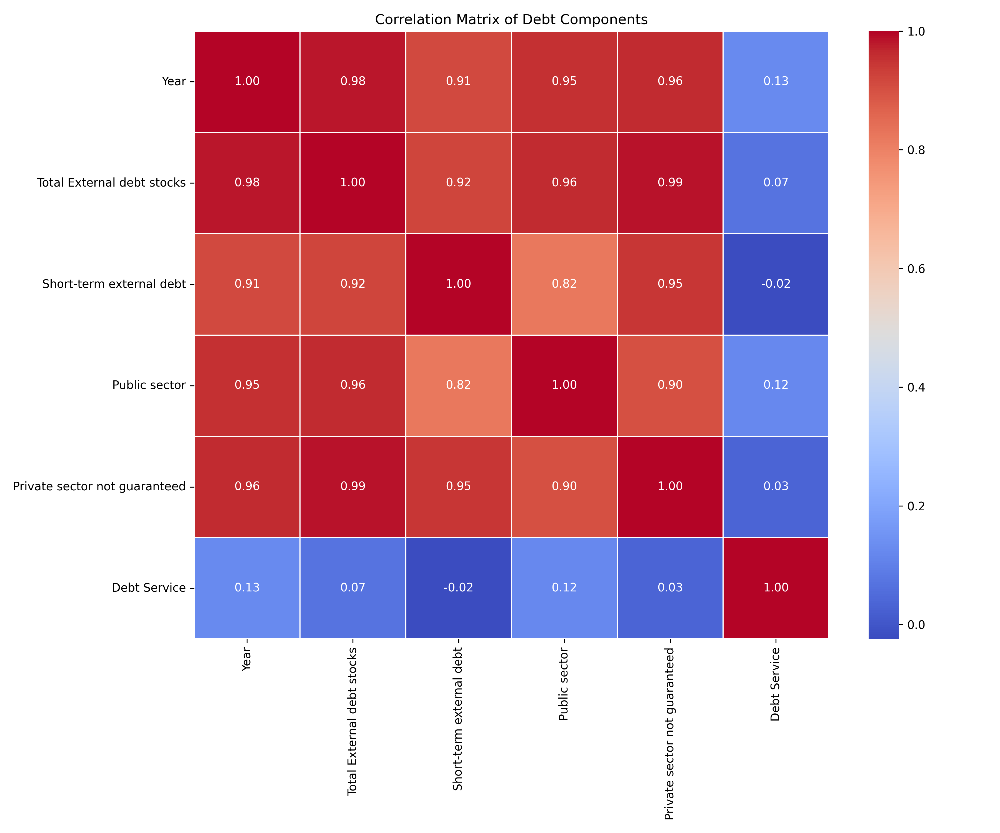
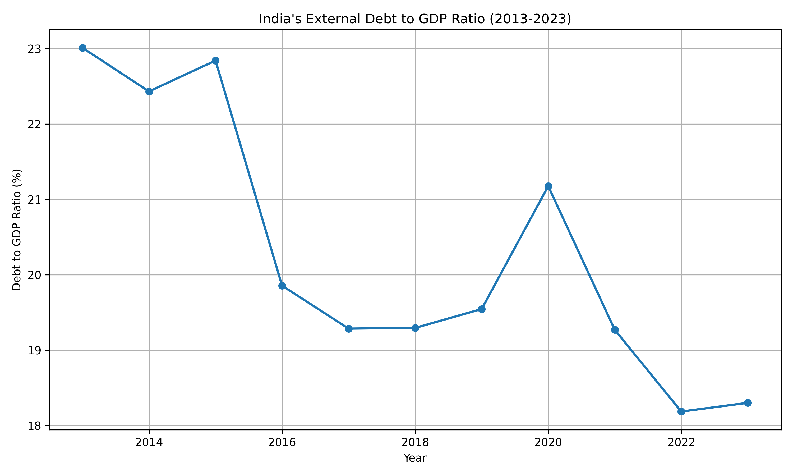
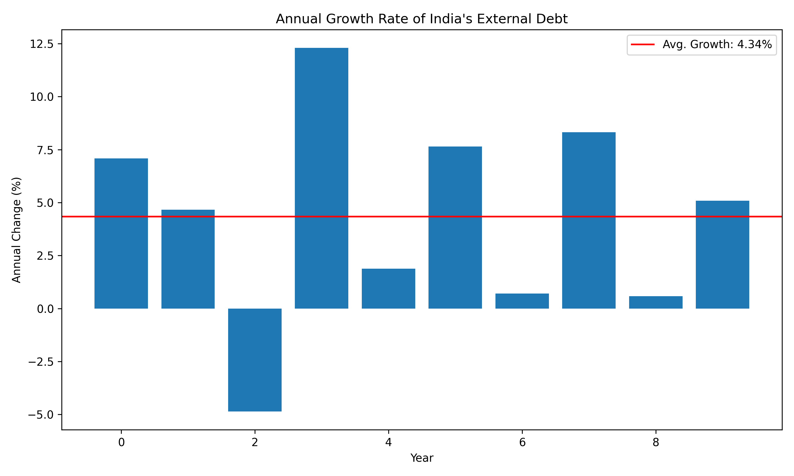
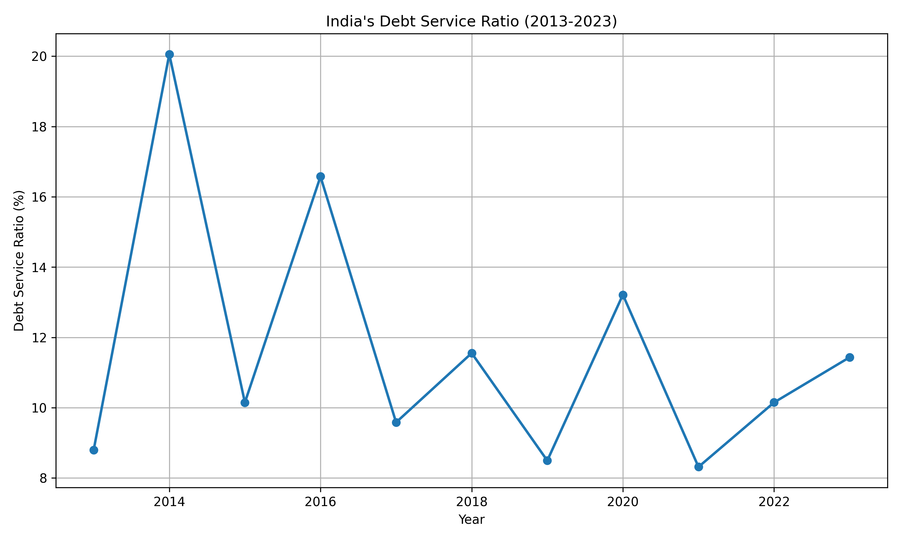
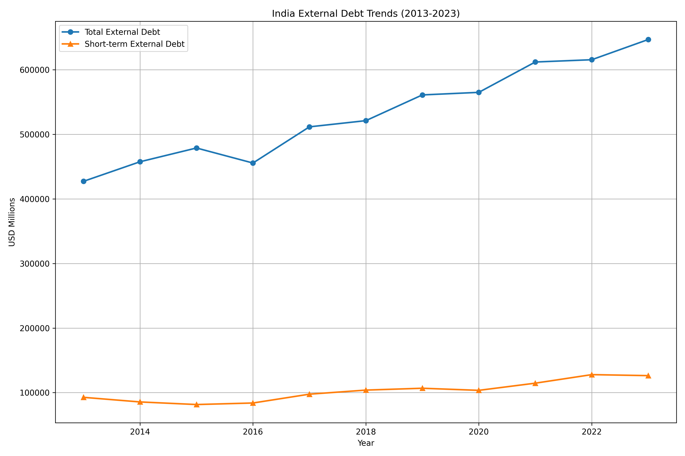

# International Debt Analysis

## Project Overview
This project provides an analysis of international debt flows using various data visualization techniques.

## Data Source
The primary data source is a collection of external debt statistics compiled from World Bank and national sources. The dataset includes various debt indicators such as total external debt, short-term debt, long-term debt, public and private sector debt, and debt service payments.

## Key Features
- Trend analysis of external debt over the last decade
- Composition analysis of debt (short-term vs. long-term)
- Debt by debtor type (public vs. private sector)
- Debt service analysis
- Debt to GDP ratio analysis
- Time series decomposition and stationarity testing

## Installation
```bash
pip install -r requirements.txt
```

## Usage
- To run the complete analysis pipeline:
```bash
python main.py
```
- To run specific steps of the pipeline:
```bash
python main.py --steps preprocessing analysis visualization```
```
## Analysis Components
- Data Preprocessing: Cleans and structures the raw debt data
- Time Series Analysis: Analyzes debt trends and seasonality
- Debt Composition Analysis: Examines the composition of debt by type and debtor
- Ratio Analysis: Calculates and visualizes key debt ratios including debt-to-GDP
- Visualization: Creates comprehensive visualizations of all analysis results

## Contributing
Contributions are welcome! Please fork the repository and submit a pull request.

## License
This project is licensed under the MIT License.

## Outputs

The project generates several visualizations that provide insights into international debt analysis. These outputs are located in the `results/figures` directory and include:

- Displays the correlation between different debt indicators

- Shows the ratio of debt to GDP over time.

- Illustrates the growth rate of debt.

- Visualizes the debt service ratio.

- Highlights the debt trends in India.


These visualizations are integral to understanding the project's analytical capabilities and provide a comprehensive view of the data analyzed.